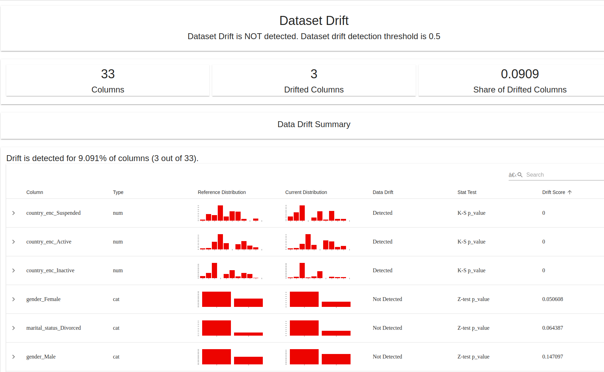

## Prédiction du Statut de Compte – MLOps de bout en bout


### Démonstration interactive
[](https://predictionstatutcompte-kfxgmqeampjqfsoe6nbpjq.streamlit.app/)


### Objectif du projet

Ce projet illustre la mise en œuvre **complète d’un pipeline MLOps** permettant de :
- **entraîner un modèle de machine learning** (Random Forest),
- **déployer une API de prédiction** via FastAPI et Docker,
- **automatiser les tests, le build et le déploiement** avec GitHub Actions,
- **offrir une interface utilisateur intuitive** sur Streamlit Cloud.
  
Le tout avec un suivi expérimental via **MLflow**, une explicabilité avec **SHAP**, et un monitoring via notebook Jupyter.

Cette démarche suit une logique **modulaire et scalable**, typique d’un pipeline MLOps de production.

Elle inclut :
- **MLflow** pour le suivi des expérimentations et versionnement du modèle,  
- **FastAPI** pour l’exposition du modèle en API REST,  
- **Docker** pour la conteneurisation,  
- **GitHub Actions** pour le CI/CD,  
- **Streamlit Cloud** pour le tableau de bord de prédiction,  
- **SHAP** pour l’explicabilité des décisions,  
- **Monitoring manuel** pour suivre les performances du modèle.


### Structure du dépôt

``` 

PredictionStatutCompte/
│── app/
│   ├── FastAPI.py              # API FastAPI pour servir le modèle
│
│── Scripts/
│   ├── train_model.py           # Entraînement et sauvegarde du modèle
│   ├── web_app.py                   # Application Streamlit
│
│── tests/
│   ├── test_api.py              # Tests unitaires de l'API FastAPI
│
│── models/                      # Modèles sauvegardés
│── Donnees/                        # Données d'entraînement et de test
│── monitoring.ipynb             # Suivi des performances du modèle
│── shap.ipynb                   # Explicabilité des variables avec SHAP
│── requirements.txt             # Dépendances Python
│── Dockerfile                   # Image Docker de l’API
│── .github/workflows/mlops.yml  # Workflow CI/CD GitHub Actions
│── README.md                    # Documentation du projet

``` 

### Déploiement & Exécution

#### Exécution locale
```
git clone https://github.com/DataEngineer87/Statut-Compte-Clients.git
cd Statut-Compte-Clients
python -m venv venv
source venv/bin/activate  
pip install -r requirements.txt
uvicorn app.fast_api:app --reload --host 127.0.0.1 --port 8000

```


### Pout tester l’API localement
```
curl -X POST http://127.0.0.1:8000/predict \
-H "Content-Type: application/json" \
-d '{
  "gender": "Male",
  "marital_status": "Single",
  "employment_status": "Employed",
  "education_level": "Bachelor",
  "subscription_type": "Premium",
  "age_group": "35-44",
  "number_of_children": 2,
  "children_per_age": 0.5,
  "log_annual_income": 10.5,
  "country": "France"
}'
```


### Résultat attendu

L’application prédit si un **compte client** est **actif ou inactif**,  
à partir de caractéristiques sociodémographiques et comportementales (revenu, âge, type d’abonnement, etc).

Dans notre cas, ona a : 
```
{"prediction": "Active"}
```

### Déploiement avec Docker

```
docker build -t alseny87/statusclients-api:latest .
docker run -d -p 8000:8000 --name fastapi_app alseny87/statusclients-api:latest
curl http://127.0.0.1:8000/predict
```

### CI/CD — GitHub Actions
Workflow automatisé dans .github/workflows/mlops.yml
```
- name: Vérification du /predict
  run: |
    docker run -d -p 8000:8000 --name fastapi_test ${{ secrets.DOCKER_USERNAME }}/statusclients-api:latest
    sleep 5
    curl -X POST http://127.0.0.1:8000/predict -H "Content-Type: application/json" -d '{"gender": "Male", ...}'
```

Chaque push sur main déclenche :
- Tests unitaires 
- Build Docker 
- Push vers Docker Hub 
- Vérification automatique du endpoint /predict

### Application Streamlit (Cloud)

Interface interactive pour tester le modèle :
👉 Application hébergée sur Streamlit Cloud

### Monitoring & Explicabilité
Les notebooks intégrés permettent de :
- suivre les performances du modèle dans le temps,
- expliquer les variables clés grâce à SHAP.

Ils ne sont pas inclus dans le workflow CI/CD (par souci d’efficacité), mais servent à des ***analyses post-déploiement.***
### Stack Technique

| Catégorie                 | Outils & Technologies |
| ------------------------- | --------------------- |
| **Langage principal**     | Python 3.10+          |
| **API Backend**           | FastAPI               |
| **Conteneurisation**      | Docker                |
| **CI/CD Automation**      | GitHub Actions        |
| **Interface Utilisateur** | Streamlit Cloud       |
| **Suivi Expériences**     | MLflow                |
| **Explicabilité**         | SHAP                  |
| **Tests Unitaires**       | pytest                |

### Points Forts du Projet
- Pipeline MLOps complet — du notebook au déploiement
- API conteneurisée et testée automatiquement
- Intégration continue (CI) et livraison continue (CD)
- Visualisation interactive avec Streamlit
- Explicabilité et transparence avec SHAP
- Architecture cloud-ready (Docker + GitHub Actions)
- Code structuré et maintenable pour production

# Auteur

### Réalisé par : Alseny SACKO

***Data Scientist & Machine Learning Engineer — Passionné par le déploiement et l’explicabilité des modèles IA.***


<a href="images/AppStreamlit.pdf">
  
</a>


