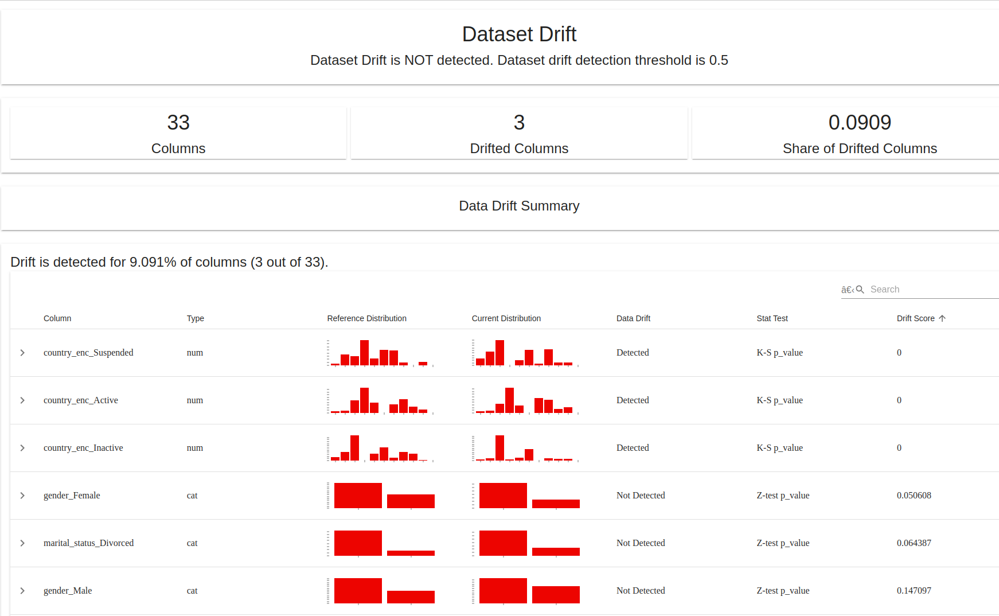

## Prédiction du Statut de Compte – MLOps de bout en bout


---

### Démonstration interactive
[](https://predictionstatutcompte-kfxgmqeampjqfsoe6nbpjq.streamlit.app/)

---

---

### Objectif du projet

Ce projet démontre la mise en place d’un pipeline **MLOps complet** :  
de l’entraînement d’un modèle de machine learning, jusqu’à son **déploiement automatisé en production**, via **FastAPI**, **Docker**, et **GitHub Actions**.

Il inclut :
- **MLflow** pour le suivi des expérimentations,  
- **FastAPI** pour l’exposition du modèle en API REST,  
- **Docker** pour la conteneurisation,  
- **GitHub Actions** pour le CI/CD,  
- **Streamlit Cloud** pour le tableau de bord de prédiction,  
- **SHAP** pour l’explicabilité des décisions,  
- **Monitoring manuel** pour suivre les performances du modèle.

### Description rapide du pipeline

| Étape | Technologie | Description |
|:------|:-------------|:------------|
| **Entraînement** | MLflow | Suivi et versionnement du modèle |
| **Déploiement API** | FastAPI + Docker | Déploiement d’une API REST pour la prédiction |
| **CI/CD** | GitHub Actions | Build + tests + push automatique sur Docker Hub |
| **Interface utilisateur** | Streamlit Cloud | Interface de prédiction accessible en ligne |
| **Explicabilité & Monitoring** | SHAP + Notebook | Analyse de l’importance des variables et suivi des métriques |

---

### Résultat attendu

L’application prédit si un **compte client** est **actif ou inactif**,  
à partir de caractéristiques sociodémographiques et comportementales (revenu, âge, type d’abonnement, etc).

*Exemple d'appel à l'API :*

```bash
curl -X POST http://127.0.0.1:8000/predict \
-H "Content-Type: application/json" \
-d '{
  "gender": "Male",
  "marital_status": "Single",
  "employment_status": "Employed",
  "education_level": "Bachelor",
  "subscription_type": "Premium",
  "age_group": "35-44",
  "number_of_children": 2,
  "children_per_age": 0.5,
  "log_annual_income": 10.5,
  "country": "France"
}

<a href="images/AppStreamlit.pdf">
  
</a>


